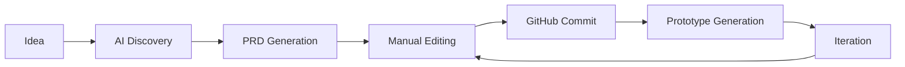

# PRD Dev

> Transform ideas into prototype-ready PRDs with AI-powered guidance

## Overview

PRD Dev is a privacy-first tool that helps product managers, founders, and engineers create comprehensive Product Requirements Documents (PRDs) through AI-guided conversations. It treats PRDs as code - versionable, trackable, and directly executable into working prototypes.

## Key Features

- **AI-Powered Discovery**: Conversational interface that asks the right questions to clarify product requirements
- **Privacy-First**: Bring your own API keys (OpenAI/Anthropic), no data stored on servers
- **Git-Native Workflow**: Each PRD gets its own GitHub repository with full version control
- **Live Markdown Editor**: Real-time preview with Monaco editor
- **Prototype-Ready Output**: Generate optimized prompts for v0, Cursor, Claude, and other AI tools
- **Template Library**: Pre-built templates for B2B SaaS, Consumer Apps, AI Products, and more
- **Local Storage**: PRDs saved locally using IndexedDB for complete privacy

## Quick Start

### Prerequisites

- Node.js 18+ and npm
- GitHub account (for OAuth integration)
- API keys from OpenAI and/or Anthropic

### Installation

1. Clone the repository:
```bash
git clone https://github.com/yourusername/prd-dev.git
cd prd-dev
```

2. Install dependencies:
```bash
npm install
```

3. Set up environment variables:
```bash
cp .env.example .env.local
```

4. Configure GitHub OAuth:
   - Go to [GitHub Settings > Developer settings > OAuth Apps](https://github.com/settings/developers)
   - Create a new OAuth App
   - Set Authorization callback URL to: `http://localhost:3000/auth/github/callback`
   - Copy the Client ID to `.env.local`

5. Run the development server:
```bash
npm run dev
```

6. Open [http://localhost:3000](http://localhost:3000)

## Usage

### Getting Started

1. **Configure API Keys**: Go to Settings and add your OpenAI or Anthropic API key
2. **Start a Conversation**: Click on "AI Discovery" and describe your product idea
3. **Refine Requirements**: Answer the AI's clarifying questions to build a comprehensive PRD
4. **Edit and Preview**: Switch to the PRD Editor to fine-tune the markdown
5. **Export for Prototyping**: Generate prompts optimized for your preferred AI tool

### Workflow



## Architecture

### Tech Stack

- **Frontend**: Next.js 14, React 18, TypeScript
- **Styling**: Tailwind CSS
- **Editor**: Monaco Editor
- **Markdown**: react-markdown with GitHub Flavored Markdown
- **Storage**: IndexedDB (via idb)
- **AI Integration**: OpenAI SDK, Anthropic SDK
- **Version Control**: GitHub API via Octokit

### Privacy & Security

- **Zero Server Storage**: All data processing happens client-side
- **BYOK (Bring Your Own Key)**: API keys stored in browser's secure storage
- **Local-First**: PRDs saved to IndexedDB, not our servers
- **GitHub Integration**: Direct OAuth, no intermediary storage

## Development

### Project Structure

```
prd-dev/
├── app/                    # Next.js app directory
│   ├── layout.tsx         # Root layout
│   ├── page.tsx           # Main application
│   └── globals.css        # Global styles
├── components/            # React components
│   ├── ChatInterface.tsx  # AI chat UI
│   ├── MarkdownEditor.tsx # PRD editor
│   ├── ApiKeyManager.tsx  # API key configuration
│   └── ...
├── lib/                   # Core libraries
│   ├── ai-service.ts     # AI integration
│   ├── storage.ts        # IndexedDB operations
│   └── templates.ts      # PRD templates
├── hooks/                 # Custom React hooks
├── types/                 # TypeScript definitions
└── utils/                 # Utility functions
```

### Available Scripts

```bash
npm run dev      # Start development server
npm run build    # Build for production
npm run start    # Start production server
npm run lint     # Run ESLint
```

## Deployment

### Vercel (Recommended)

1. Push to GitHub
2. Import project in Vercel
3. Add environment variables
4. Deploy

### Self-Hosting

1. Build the application:
```bash
npm run build
```

2. Start the production server:
```bash
npm run start
```

3. Use a process manager like PM2 for production:
```bash
pm2 start npm --name "prd-dev" -- start
```

## Contributing

Contributions are welcome! Please read our [Contributing Guide](CONTRIBUTING.md) for details.

## License

MIT License - see [LICENSE](LICENSE) for details

## Support

- **Documentation**: [docs/](./docs)
- **Issues**: [GitHub Issues](https://github.com/yourusername/prd-dev/issues)
- **Discussions**: [GitHub Discussions](https://github.com/yourusername/prd-dev/discussions)

## Acknowledgments

- OpenAI for GPT-4 API
- Anthropic for Claude API
- Next.js team for the amazing framework
- All contributors and early adopters

---

*Built with ❤️ for product managers who code and coders who product manage*